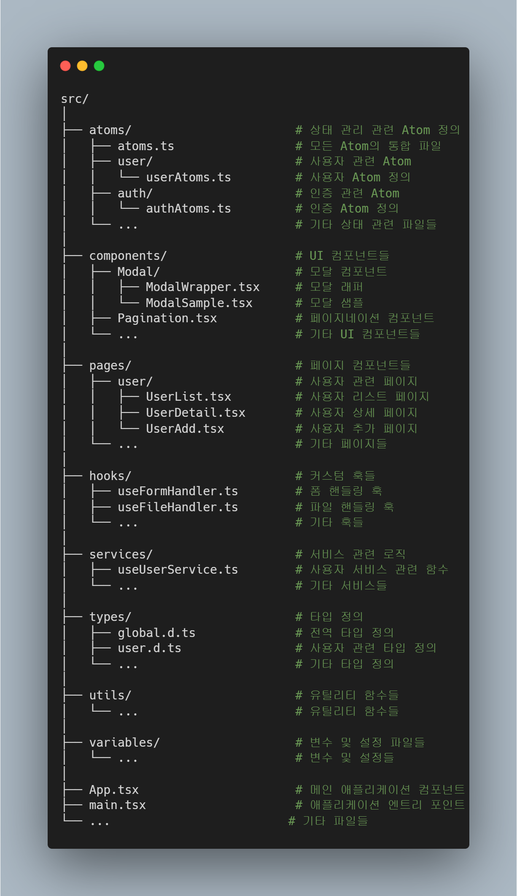

## 디렉토리 설명

- **`atoms/`**: 상태 관리에 사용되는 Atom 정의를 포함합니다. 각 하위 디렉토리에는 특정 기능(예: 사용자, 인증) 관련 Atom이 포함되어 있습니다.
- **`components/`**: UI 컴포넌트들이 위치합니다. 재사용 가능한 컴포넌트와 레이아웃 요소를 포함합니다.
- **`pages/`**: 애플리케이션의 페이지 컴포넌트들이 위치합니다. 각 페이지는 사용자 인터페이스의 주요 부분을 구성합니다.
- **`hooks/`**: 커스텀 훅들을 포함합니다. 상태 관리, 데이터 처리 등에서 재사용 가능한 훅들을 정의합니다.
- **`services/`**: API 호출 및 비즈니스 로직을 처리하는 서비스 모듈을 포함합니다.
- **`types/`**: TypeScript 타입 정의를 포함합니다. 전역 타입, 사용자 관련 타입 등을 정의합니다.
- **`utils/`**: 유틸리티 함수들이 위치합니다. 다양한 헬퍼 함수들이 여기에 포함됩니다.
- **`variables/`**: 애플리케이션에서 사용하는 변수와 설정들을 포함합니다.

### 주요 파일

- **`App.tsx`**: 애플리케이션의 메인 컴포넌트를 정의합니다.
- **`main.tsx`**: 애플리케이션의 엔트리 포인트입니다.
